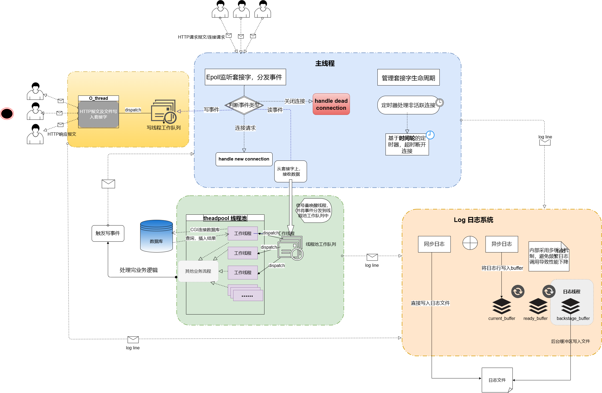

# 1. 功能以及使用指南

- #### 功能:

可以实现用户注册与登录

可以获取服务器合法/可访问的文本文件或目录

- #### 使用:

```shell
cd ./build  #切换目录

cmake..     #生成makefile

make        #编译

../server   #运行
```

- #### demo演示

<div align=center> </div>

# 2.整体架构

​	[2.1 对比TinyWebServer](#2.1对比[TinyWebServer](https://github.com/qinguoyi/TinyWebServer))

​	[2.2 主线程(reactor / class WebServer)](#2.2主线程(reactor/classWebServer))

​		[2.2.1主线程负责](#2.2.1主线程负责)

​		[2.2.2 I/O分离](#2.2.2I/O分离)

​	[2.3一些细节](#2.3一些细节)

​		[2.3.1 实现大文件传输----内存映射mmap](#2.3.1实现大文件传输----内存映射mmap)

​		[2.3.2 保证线程安全----std::shared_ptr](#2.3.2保证线程安全----std::shared_ptr)

​	[2.4 美好的梦想破灭了](#2.4美好的梦想破灭了)

​		[2.4.1 原本设想实现类似于云服务器](#2.4.1原本设想实现类似于云服务器)

​		[2.4.2 本来想用FIFO秀一下肌肉](#2.4.2 本来想用FIFO秀一下肌肉)

一开始我想着参照[TinyWebServer](https://github.com/qinguoyi/TinyWebServer)  , 做一个复现, 但是转念又觉得这样做是否太没新意并且非常无聊?事实也确实如此, 每当存在一个技术难点时,第一时间竟然是去套用他人的解决方案, 这种感觉很被动, 就像是被人牵着鼻子走的感觉, 但是我很不喜欢这种感觉。并且事实也证明[TinyWebServer](https://github.com/qinguoyi/TinyWebServer)有时候提供的方案也并非总是最优方案



## 	2.1对比[TinyWebServer](https://github.com/qinguoyi/TinyWebServer)

- #### Reactor 与 Proactor

     在[TinyWebServer](https://github.com/qinguoyi/TinyWebServer) 的`Reactor` 模式下 ,  主线程会等待子线程完成所有业务流程后才会执行下一步操作, 在此过程中, 主线程完全被阻塞, 无法进行任何其他操作, 这样多线程高并发的特性无法被很好地体现。这样的设计,我认为还不就开一条线程
  
  ​    而在[TinyWebServer](https://github.com/qinguoyi/TinyWebServer)  的`Proactor` 模式下 , 终于支持了主线程和工作线程异步性, 并且所有IO 操作由主线程负责, 而工作线程仅负责具体业务逻辑(HTTP)
  
  ​    但是我认为, Reactor 模式最核心的部分就是说反应器(项目中:主线程) , 当在某个套接字上有事件发生, 反应器(主线程)可以分发事件交给对应的handler进行即可, 并且当handler完成工作后, 只需要向主线程notify即可(在本项目中表现为 : 在套接字上 , 注册写事件)
  
  ​    而Proactor模式作为一种异步I/O模型, 需要操作系统提供底层支持, 我认为并不适合来描述一种服务器端架构。
  
  ​	在我看来[TinyWebServer](https://github.com/qinguoyi/TinyWebServer)的Proactor模式更像是一种单反应器多线程的Reactor模式, 而它的Reactor模式就显得有些absurd

- #### class http_conn(class http_connection)

​	  	在[TinyWebServer](https://github.com/qinguoyi/TinyWebServer)  的class conn 中 , 既有面向传输层网络传输数据的I/O操作`read()` ,`write()`....又有面向应用层的处理具体业务逻辑的操作 , 我认为这违反了分层原则, 一个类(而且是很明显仅面向应用层(HTTP)的)不应该同时支持两种网络层的操作。

​		在本项目中 线程池中的工作线程仅负责处理业务逻辑,

​		而主线程负责:

​           1. 将客户端发来的HTTP_request 拷贝到对应的套接字对应的用户的读缓冲区中, 

​           2. 工作线程处理完业务逻辑,如果无任何错误 ,只需要将写缓冲区数据 以及 指定文件传输到网络中即可(在此过程中,主线程不会检查HTTP响应报文的格式, 因为工作线程已经检查完了 ) 

**因此, 在本项目中的class http_connection 类中无需定义任何实现网络数据传输的函数, 只关注业务逻辑即可,**

同时由于所有线程都共享同一内存区, **除了从网络中接收数据 , 和向网络中传输数据需要拷贝以外, 不存在任何额外的拷贝,** 

> 分享两篇讲Reactor和Proactor模式的文字
>
> https://goyas.github.io/reactor-proactor
>
> https://www.xiaolincoding.com/os/8_network_system/reactor.html


## 2.2主线程(reactor / class WebServer)

### 2.2.1主线程负责

- 监听事件, 并将事件分发给对应的handler

- 从网络接收或向网络传输数据 
- 建立或断开套接字连接, 并断开超时连接, 管理套接字生命周期


### 2.2.2I/O分离

由于主线程负责太多工作, 很容易成为程序的性能瓶颈, 我尝试将对网络的IO操作尝试转接给对应的套接字,`O`操作好说, 因为每当客户发来一个HTTP-Request ,服务器总会按照如下顺序执行:

当执行到准备将数据传承到网络上时, 其他线程根本不会再对该套接字所对应的用户实例进行任何操作, 因此是线程安全(thread-safe)的, 直接写入即可,具体操作流程请看[./IOthread/O_thread.md]() 

但是从主线程中分离`I`操作,就比较麻烦了, 原因如下:

- 在本项目中,WebServer 虽然会把读事件分配给读线程 , 并且由于读事件被分配给了其他线程, 主线程会立马将该请求添加至工作线程的工作队列中, 此时假设工作队列并不"拥挤" , 那么很可能出现读线程在没有完成将所有请求的数据拷贝到read_buffer 中, 工作线程就已经读取read_buffer并解析HTTP请求了。这样的竞争很可能会导致INTERVAL_ERROR!

> 我希望线程池管理权应当维持在WebServer上 故读线程不应当对线程池的工作队列进行任何操作


## 2.3一些细节

### 2.3.1实现大文件传输----内存映射mmap

在《UNIX网络编程卷2》中` mmap` 被作为一种shared memory 来作为进程间通信(**IPC**)的工具,其具体操作就是将中某个文件在磁盘的空间映射到内存中。

而在本项目中, `mmap`被用来实现大文件传输(规定文件大小大于`BUFFER_SIZE*10` 用`mmap`来传输文件),可极大减少数据的拷贝:

**相较于传统的read() write()等系统调用, 具有如下的优势:**

- **减少系统调用:**

`mmap`可将磁盘中文件直接映射到进程的虚拟内存空间中,此后任何想对文件读写, 都可以做映射到内存区进行(pointer),此过程都在用户态进行

- **支持随机访问, 编程更加灵活,简洁:**

`mmap` 直接将整个文件映射到内存，可以通过指针操作直接访问任意位置的数据，无需额外的偏移计算。同样任何读写操作 , 也就相当于操作指针 非常方便!

- **减少对描述符资源占用:**

完成内存映射后, 文件描述符可以直接关闭了


### 2.3.2保证线程安全----std::shared_ptr

我们要注意到这样一种**race condition**:

当工作线程正在调用:`user->process()`时(user 为http_connection类的一个实例), 但是套接字连接计时器(一般是主线程在执行),发现该套接字已超时, 将要关闭关闭连接 并且销毁该user实例 , 这将导致core dump 这样一种糟糕的后果。

**为了解决这样一种线程安全问题, 我采用**`std::shared_ptr<http_connection> `**智能指针来防止这种竞态条件的产生**

**首先shared_ptr 内部会有一个引用计数器 , 当且仅当引用为0 时, 智能指针会调用类的析构函数(如果有) , 并释放该内存。**

在本项目中:

- 在threadpool(线程池)中存在:

  ```c++
  /*T为http_connection 类*/
  std::list<std::shared_ptr<T> > m_dead_users ; //在处理写事件时发生错误, 需要关闭的套接字
  std::list<std::shared_ptr<T> > m_jobqueue  ;  //业务逻辑就绪队列
  ```

- 在Webserver(主线程/Reactor)中存在:

  ```c++
  std::unordered_map<int, std::shared_ptr<http_connection>> m_users ; //通过套接字查询
  ```

- 在O_thread(写线程)中存在:

  ```c++
  /*T为http_connection 类*/
  std::list<std::shared_ptr<T>> m_users_queue; //写事件就绪队列
  ```

  

## 2.4美好的梦想破灭了

### 	2.4.1原本设想实现类似于云服务器

本来想实现一个类似于云服务器功能的程序 , 可以支持一下功能:

- 用户可以上传本地文件到服务器端
- 用户可以选择获取用户私人空间中的所有文件
- 用户可以选择get用户存储在云端的文件内容
- 用户可以删除存储在云端的文件

后三点都能很好实现 , 但主要就是第一点比较困难:

1.由于read()等传统的IO函数, 输入输出都为字节流, 无法控制buffer的状态,用户上传的文件可能追加在HTTP报文尾部, 很可能会随文件一同拷贝到`read_buffer`中, 但是`read_buffer`仅有`4096b`默认情况下指定,假设文件异常大那么buffer不足以暂存如此大的文件, 并且主线程仅负责将套接字上的数据拷贝到buffer, 不会对数据进行任何的analyze,也不会创建一个文件或者一块更大的buffer来暂存数据,因此必然会造成文件缺损情况以及程序异常(不会崩溃) ------这是设计架构所带来的限制,如果说若需要支持这种功能需要对整个项目进行重构, 时间成本非常高。

2.文件会以何种形式进行传输呢? 是否会进行压缩,是否存在其他文件编码? 同时后台为此需要对此进行额外解码? 

3.如何设计一个功能更为强大的前端界面, 能够提供一个统一的前端框架, 当用户登录时, 可以定制私有化的用户界面? 如何能够满足:能够访问本地文件,并上传至后台;能够仅通过鼠标pick想要删除的文件,并将该请求发送给后台;以及如何设计一个目录框能够显示当前用户所有文件?

总的来说主要是时间成本的问题, **我认为与其花时间来研究HTTP协议和前端框架, 倒不如抽时间来学习LINUX更多神奇的内部机制, 以及强大的nginx服务器的架构以及实现细节等诸如此类的更深入的技术**

### 	2.4.2本来想用FIFO秀一下肌肉

在项目开发阶段，正好在读《UNIX网络编程卷2》，正好看到“管道和FIFO"这一章，里面提到FIFO可以作为一种实现无亲缘关系（fork）的进程间通信， 当时我就想在主程序外来再开发出一个脚本：工作线程可以通过FIFO向脚本进程传输想要获取的文件 ， 脚本则通过工作线程传来的文件路径，来判断是否存在， 是否有权限， 能否打开 ， 以及文件内容再通过一个共享内存区（可简化成一个文件^1^）传输给后台。

> 1.数据传输工作分为两个部分：传输HTTP报文（write_buffer）,以及传输文件。由于脚本进程完成对文件书写后，工作线程不会对该文件进行任何更改，因此为了保证操作一致性，故简化成一个文件

这很drama，,多个线程有可能同时向FIFO传输数据（虽然能保证各个线程此操作的原子性，进而保证不会出现数据混乱^2^）,虽然我能规定每个线程向FIFO写入数据段（有明确的分界`\n`），**但是一旦写入进FIFO后数据段就成了流式数据，因此在某一次脚本进程在进行read()操作时， 无法根据数据分段来确定数据读取到哪里，因此每一次读取操作读取到数据范围是不确定的 ，也就会产生接收数据不完整的情况** ， 我参考了一下书上， 虽然书上也有实现类似功能的程序，当时没想太多，以为书上存在这种能够分段读取数据流的合理方案， 就准备在工程走到这一步的时候再翻书， 结果发现书上的方法特别特别暴力， 就是一个字节一个字节的读（每读一个字节调用一次read()）:joy:

> 2.POSIX.1要求PIPE_BUF至少为512字节。小于该字节数的数据写入操作具有原子性，项目依照该规定限制数据长度

同样，因为脚本只有一个进程且没有开其他线程，而工作线程有很多个，同时工作线程会阻塞等待^3^直到脚本进程完成工作线程的task，这就像一个厨师同时要为很多个餐桌的客人炒菜，菜还没开始炒，人已经饿死了。

> 3.因为很难保证脚本进程和工作线程对共享内存区（一个文件）的同步，所以我选择 直接将工作线程阻塞

那么又会有一个问题为什么不选择开多个线程？还是这一句话：**FIFO内传输的都是数据流，同样， 无法控制buffer的状态**， 为了减少程序设计的复杂程度，所有脚本的线程共享一个FIFO  因为我不希望，工作线程为选择往哪一个FIFO上传输数据而“苦恼‘’。由于该FIFO在各个线程间属于共享资源，在某一次脚本进程在进行read()操作时， **无法确定数据读取截取到哪里， 也就会产生末尾工作线程传来数据不完整的情况** ，当再次读取时则会是另一个线程，而另一个线程收到的则是这份不完整数据的另一部分。 两个线程分别收到了不完整数据的两个部分，无法正常处理该报文直接作废。同时这种异常发生的频率一定会非常高 。

总而言之，这样的idea感觉就是在为了秀肌肉而秀肌肉，没有任何实际的工程价值，反而还会成为性能瓶颈，降低程序可读性，最后选择把这个功能实现包含着`http_conn`类了由工作线程完成，没有再单独开发一个脚本。
