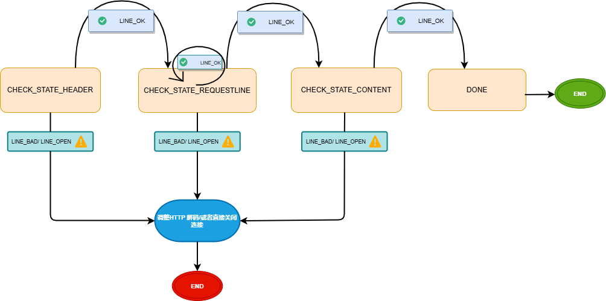

# class http_connection

**主要负责:解析HTTP 请求报文 和  生成HTTP响应报文**


## 1.解析HTTP 请求报文process_read()

### 	1.1 主从状态机

**从状态机负责读取报文的一行，主状态机负责对该行数据进行解析**，主状态机内部调用从状态机，从状态机驱动主状态机。

- #### **主状态机**

三种状态，标识解析位置。

```txt
CHECK_STATE_REQUESTLINE，解析请求行

CHECK_STATE_HEADER，解析请求头

CHECK_STATE_CONTENT，解析消息体，仅用于解析POST请求

DONE , 若状态转移至此步， 则说明完成解析操作
```

- #### 从状态机

三种状态，标识解析一行的读取状态。

```wiki
LINE_OK，完整读取一行

LINE_BAD，报文语法有误

LINE_OPEN，读取的行不完整
```




## 2.读取报文后做出处理请求do_request()

如果正确解析HTTP报文在do_request()中可能会做出如下几种处理:

- 第一种是请求某个文件资源: 此时文件路径在成员变量file_path中 , 在do_request()中会判断**文件路径是否合法, 文件是否存在, 文件是否能够读取**。如果文件出现异常则会修改HTTP解码, 并返回客户端相应报错
- 如果用户请求登录或者注册 , 则需要连接数据库,查询用户密码是否合法, 并返回客户端处理结果(更新file_path):如果登录成功则直接更新为主界面, 如果登录/注册失败则更新为错误登录/注册的文件,同样也会检查文件是否有异常

## 3.生成HTTP响应报文 process_write()

**提供函数：**

```c++
/*生成响应报文*/
void generate_response_line() ;
void generate_response_header() ; 
void generate_response_body() ; 
bool process_write() ; //该函数依次调用如上三个函数
```

由于生成响应报文内容比较固定,基本上不可能报错, 处理逻辑也非常简单,不做过多赘述。